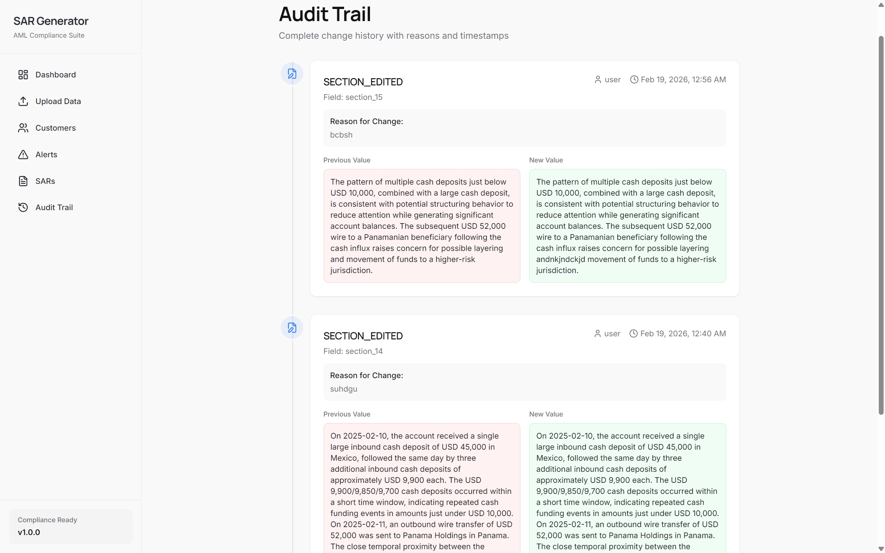
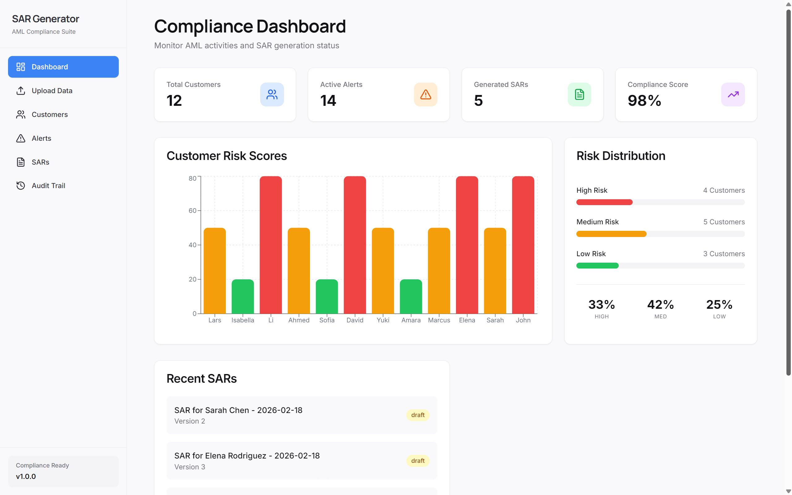
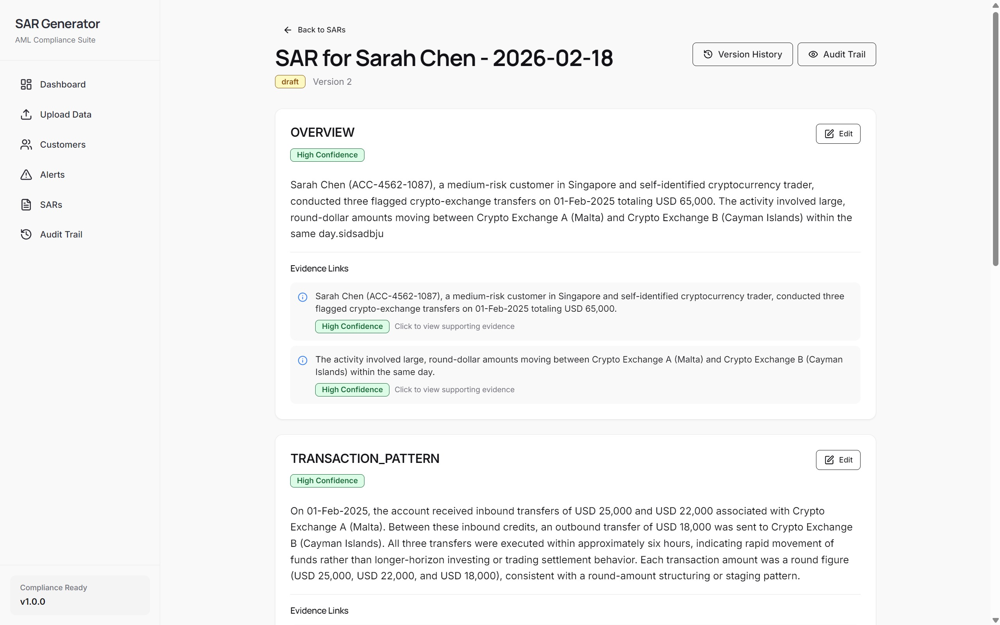

<h1>Enhanced & Auditable SAR Narrative Generation Framework</h1>

<h3><i>AI-Driven Compliance Intelligence Platform</i></h3>

 

<h2>🌟 Overview</h2>

<b> Enhanced & Auditable SAR Narrative Generation Framework </b> is an AI-powered compliance system
that automatically generates regulator-ready Suspicious Activity Report (SAR) narratives using transaction alerts,
customer data, and risk indicators.

Traditional SAR drafting takes <b>5–6 hours</b> per report. Our platform reduces this to minutes using structured reasoning
pipelines and AI model APIs while maintaining full transparency and auditability.

Unlike black-box automation tools, our system ensures that every generated statement is traceable,
explainable, and regulator-defensible.

<h2>🎯 Problem Statement</h2>

Financial institutions must submit high-quality SAR reports whenever suspicious activity is detected.
However, current workflows are manual, slow, inconsistent, and resource-intensive.

Compliance teams face growing regulatory pressure with limited manpower, making it difficult to produce
clear, accurate, and defensible narratives at scale.

There is a strong need for a system that can automatically generate structured SAR narratives while ensuring
human control, transparency, and full audit traceability.

<h2>✨ Key Features</h2>

<ul>
<li><b>AI Narrative Generator</b> — Automatically produces structured SAR reports</li>
<li><b>Explainability Engine</b> — Shows why each sentence was generated</li>
<li><b>Audit Trail Logging</b> — Tracks AI decisions, edits, and approvals</li>
<li><b>Interactive Visualization</b> — Real-time suspicious transaction graphs</li>
<li><b>Analyst Review Interface</b> — Human validation before submission</li>
<li><b>Modular Architecture</b> — Easily integrable into existing systems</li>
</ul>

<h2>🚀 Innovation & Research Insights</h2>

We studied existing enterprise compliance tools and identified major gaps:

<table border="1" cellpadding="10">
<tr>
<th>Existing Limitation</th>
<th>Our Solution</th>
</tr>

<tr>
<td>No transparency in AI output</td>
<td>Full reasoning trace</td>
</tr>

<tr>
<td>Manual narrative writing</td>
<td>Automated SAR generation</td>
</tr>

<tr>
<td>Weak audit support</td>
<td>Detailed audit logs</td>
</tr>

<tr>
<td>No visualization</td>
<td>Interactive transaction graphs</td>
</tr>

<tr>
<td>Rigid systems</td>
<td>Flexible modular architecture</td>
</tr>

</table>

<h2>🛠 Technology Stack</h2>

<table border="1" cellpadding="10">

<tr>
<th>Layer</th>
<th>Technologies Used</th>
</tr>

<tr>
<td>AI Engine</td>
<td>LLM APIs (Claude / Llama / Mistral)</td>
</tr>

<tr>
<td>Processing</td>
<td>Prompt Engineering + Structured Logic</td>
</tr>

<tr>
<td>Backend</td>
<td>Node.js + Express</td>
</tr>

<tr>
<td>Database</td>
<td>SQLite / PostgreSQL</td>
</tr>

<tr>
<td>Frontend</td>
<td>React Interface</td>
</tr>

<tr>
<td>Visualization</td>
<td>Interactive Charts</td>
</tr>

<tr>
<td>Logging</td>
<td>Structured Audit Logs</td>
</tr>

</table>

<h2>📂 System Architecture</h2>

<pre>
User Input Data
      ↓
Preprocessing Layer
      ↓
AI Model API
      ↓
Narrative Generator
      ↓
Explainability Engine
      ↓
Audit Logger
      ↓
Dashboard UI
</pre>

<h2>🖼 UI Preview</h2>

<i>Add screenshots below</i>

  
  

<h2>🔐 Compliance Principles</h2>

<ul>
<li>Explainable AI outputs</li>
<li>Human validation before submission</li>
<li>Role-based access control</li>
<li>No cross-domain data leakage</li>
<li>Complete audit trail logging</li>
<li>Regulator-ready reporting</li>
</ul>

<h2>👨‍💻 Team</h2>

<b>Diyan Maner</b> — <a href="mailto:diyan.maner24@vit.edu">diyan.maner24@vit.edu</a>  

<b>Akash Harkar</b> — <a href="mailto:akash.harkar24@vit.edu">akash.harkar24@vit.edu</a>  

<b>Krishna Ghogare</b> — <a href="mailto:krishna.ghogare242@vit.edu">krishna.ghogare242@vit.edu</a>  

<b>Tanvi Chopade</b> — <a href="mailto:tanvi.chopade24@vit.edu">tanvi.chopade24@vit.edu</a>

<b>Built for Barclays Hackathon • Compliance AI Innovation Track</b>

  

⭐ Star this repository if you found it useful ⭐

